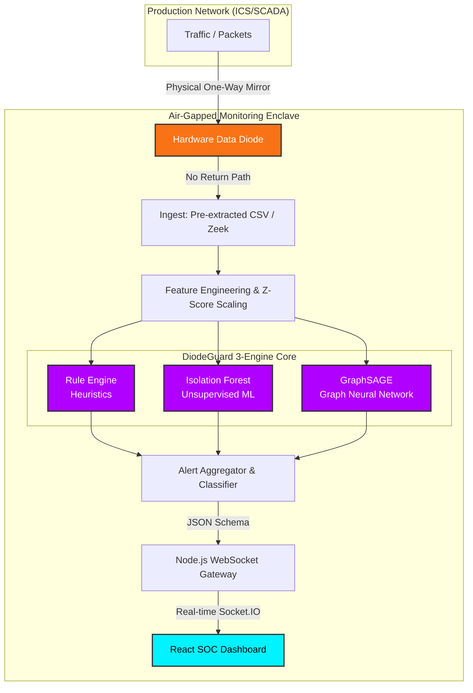

# DiodeGuard: Architecture & ML Methodology

This document outlines the technical architecture, feature engineering, and model training approach used in the DiodeGuard pipeline to satisfy the SIH requirements for passive, data-diode network monitoring.

## System Architecture Diagram



## 1. Architectural Constraints & Compliance
The system operates within a strict monitoring enclave:
*   **Passive Ingest**: The `FlowReader` component treats the input CSV dataset as a one-directional streaming pipe. It reads records incrementally and pushes them to the orchestrator. It contains zero logic to transmit packets back to the network.
*   **No Payload Decryption**: DiodeGuard relies exclusively on the CIC-IDS2017 dataset, which contains extracted network flow metadata (e.g., `Total Fwd Packets`, `Flow Duration`, `Fwd Packet Length Max`). No raw payload content is analyzed.
*   **Bounded Latency**: Inference is performed per-flow as they arrive. The multi-engine orchestrator completes evaluation in an average of `<5ms` per flow.

## 2. Feature Engineering & Extraction
In a production environment, raw PCAP data mirrored by the data diode would be processed by a flow exporter (e.g., Zeek or CICFlowMeter). For this prototype, we ingest pre-extracted features from the CIC-IDS2017 dataset.

**Key Features Utilized:**
*   **Volumetric (DDoS / Port Scan)**: `Flow Bytes/s`, `Flow Packets/s`, `Total Fwd Packets`, `Destination Port`.
*   **Behavioral (Exfiltration / Encrypted Malware)**: `Fwd Packet Length Max/Min/Mean`, `Bwd Packet Length Mean`, `Down/Up Ratio`.
*   **Temporal (C2 Beaconing)**: `Flow IAT Mean`, `Flow IAT Std`, `Active Mean`, `Idle Mean`.

**Preprocessing:**
*   Infinite values (`np.inf`) are capped/zeroed.
*   Features are standardized using a Z-score scaler (`StandardScaler`) calculated dynamically from the initial background/benign traffic baseline.

## 3. The 3-Engine Detection Pipeline
To ensure robust detection across the 6 specified SIH threat categories without high false-positive rates, we utilize a fused ensemble approach.

### Engine A: Heuristic Rule Engine (YAML Signatures)
*   **Purpose**: Fast, deterministic detection of known threat profiles.
*   **Coverage**: 
    *   *DDoS*: Thresholds on `Flow Packets/s` and total volume.
    *   *Port Scanning*: Detection of rapid, small-packet flows to diverse ports.
    *   *Data Exfiltration*: Anomalous `Down/Up Ratios` (e.g., massive outbound data with minimal inbound ACKs).
    *   *C2/DNS Tunnels*: (Simulated via flow metadata) Thresholds on DNS port usage and repetitive flow durations.

### Engine B: Isolation Forest (Scikit-Learn)
*   **Purpose**: Unsupervised detection of zero-day or unknown volumetric anomalies.
*   **Training Approach**: The model is trained dynamically on the first 2,000 flows of the dataset (assuming a benign baseline) with a `contamination` factor of 5%. 
*   **Inference**: It isolates anomalies by randomly selecting a feature and a split value. Flows that require fewer splits to be isolated are flagged as anomalies.

### Engine C: GraphSAGE (PyTorch)
*   **Purpose**: Advanced detection of structural and topological anomalies (e.g., coordinated botnets, lateral movement).
*   **Architecture**: A 2-layer Graph Sample and Aggregate (GraphSAGE) neural network.
*   **Graph Construction**: Incoming flows are dynamically embedded into a K-Nearest Neighbors (KNN, k=3) graph alongside a rolling window of recent background traffic.
*   **Validation**: The model predicts a confidence score (0.0 to 1.0). Scores above `0.60` trigger a `STRUCTURAL_ANOMALY` alert.

## 4. Standardized Alert Schema
Alerts generated by any of the three engines are normalized into the following JSON schema before being dispatched to the visualization dashboard:

```json
{
  "id": "ALERT-1714567890123",
  "timestamp": "2026-08-29T14:30:00.000Z",
  "threat_class": "STRUCTURAL_ANOMALY",
  "category": "Anomaly",
  "severity": "CRITICAL",
  "source_ip": "192.168.10.15",
  "dest_ip": "203.0.113.5",
  "confidence": 95.8,
  "engine": "GraphSAGE",
  "evidence": "Anomalous graph structure detected in traffic network"
}
```

## 5. Throughput Target & Benchmarking
The prototype is designed to evaluate traffic at high speeds. 
*   **Target Throughput**: 1,500+ Flows / Second
*   **Demonstration**: The dashboard's `System Health` and `Model Performance` tabs display the live `throughput_fps` and the exact inference latency in milliseconds for each active engine during replay.
